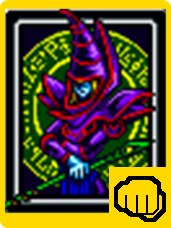
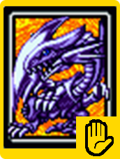
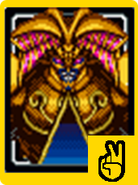
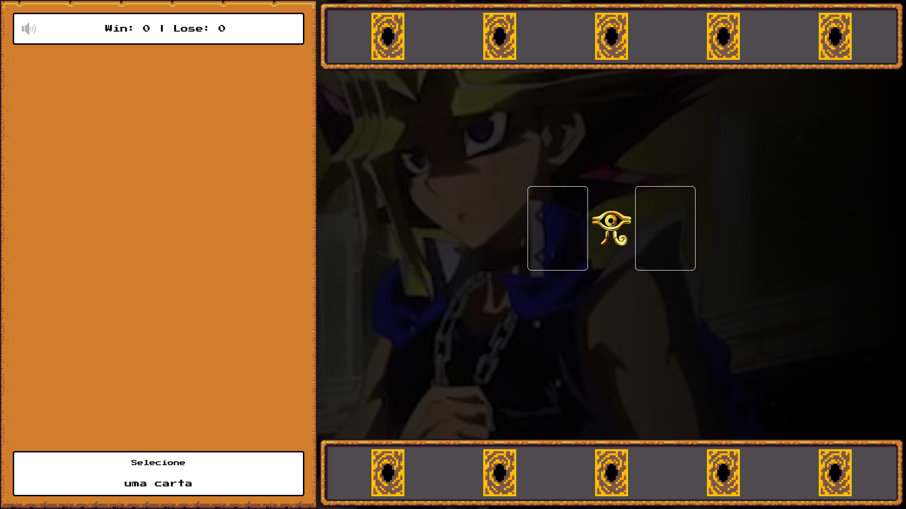
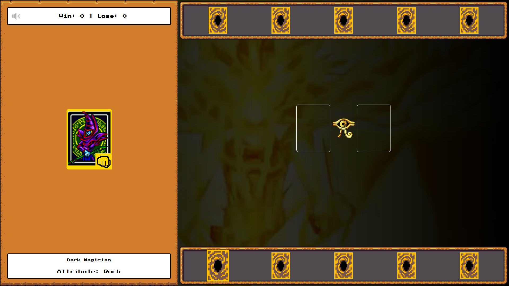
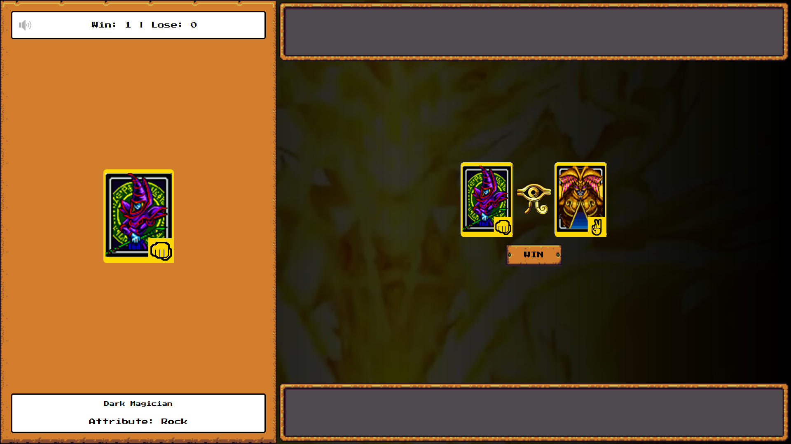

# Yu-Gi-Oh

> Desafio DIO - Jogo de Cartas do Yu-Gi-Oh! com HTML, CSS e JavaScript para mais informações visite o meu site: [www.maurogallotta.com](https://maurogallotta.com/projetos-de-games/)

## 📋 Índice

- [📖 Sobre](#-Sobre)
- [🚀 Tecnologias utilizadas](#-Tecnologias-utilizadas)
- [🖥 Preview](#-Preview)
- [📌 Créditos](#-Créditos)

## 📖 Sobre

Projeto desenvolvido durante o Bootcamp [Potência Tech iFood - Desenvolvimento de Jogos](https://web.dio.me/track/potencia-tech-ifood-desenvolvimento-de-jogos) com o professor [Felipe Aguiar](https://github.com/felipeAguiarCode). O objetivo desse projeto é desenvolver um versão do tracional jogo "Pedra, Papel e Tesoura" com inspiração na temática de Yu-Gi-Oh, utilizando apenas HTML, CSS e Javascript.

O jogo funciona de maneira simples, o jogador seleciona a carta que deseja jogar e tenta a sorte. No jogo, há três tipos distintos de cartas:

  

    <h4 style="text-align: center" >Dark Magician | Pedra</h4>
    
  

  

    <h4 style="text-align: center">Blue Eyes White Dragon | Papel</h4>
    
  

  

    <h4 style="text-align: center">Exodia | Tesoura</h4>
    
  

 

Após a escolha da carta pelo jogador, o computador faz a sua seleção. O resultado é determinado com base nas interações entre as cartas. É importante lembrar que Pedra vence Tesoura, Tesoura vence Papel e Papel vence Pedra.

## 🚀 Tecnologias utilizadas

## 🖥 Preview:

  
  
  

## 📌 Créditos:

- Os assets utilizados no projeto estão disnponíveis no repositório: [digitalinnovationone/js-yugioh-assets](https://github.com/digitalinnovationone/js-yugioh-assets).
- Também foi utilizado o framework [RPGUI](https://github.com/RonenNess/RPGUI) que fornece uma conjunto de assets no estilo RPG pronto para uso.

